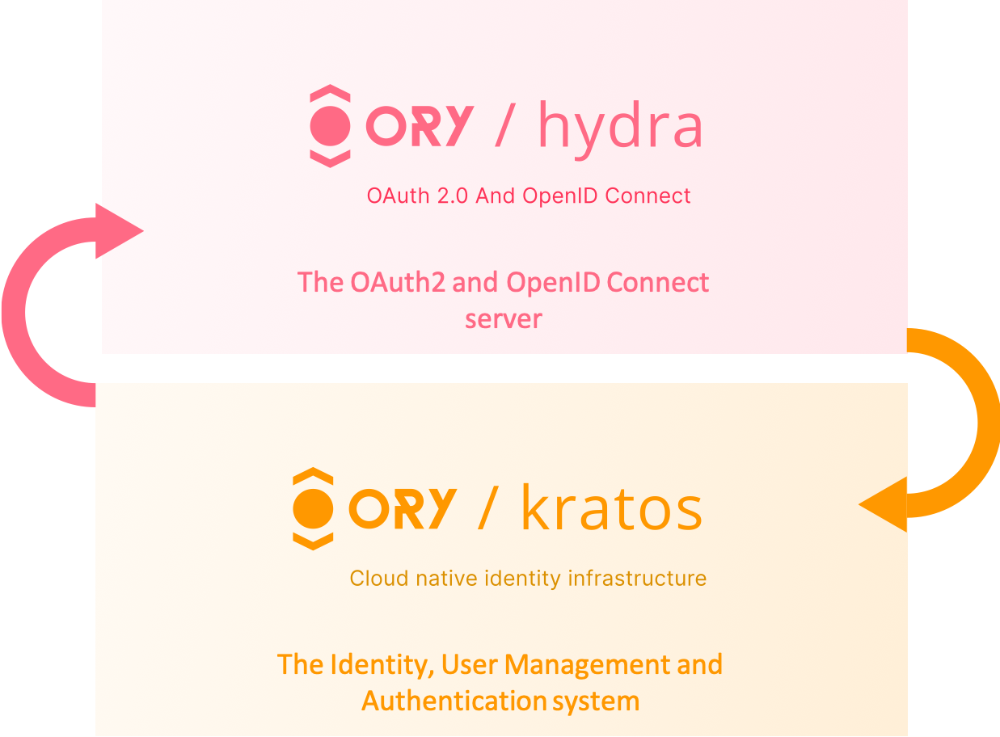

# Ory Hydra and Kratos

<p align="center">
  
</p>

<!-- CONTACTS -->
<div>
    <p align="center">
        <br />
        <a href="#about-project">About Project</a>
        ·
        <a href=mailto:"konstantin.priluchnyi@gmail.com?subject=report%20Bug">Report Bug</a>
        ·
        <a href=mailto:"konstantin.priluchnyi@gmail.com?subject=Request%20Feature">Request Feature</a>
    </p>
    <p align="center">
        <a href=mailto:"konstantin.priluchnyi@gmail.com">
            
        </a>
        <a href="https://t.me/konstantin_evo">
            
        </a>
        <a href="https://www.linkedin.com/in/konstantin-evo/">
            
        </a>
    </p>
</div>

## About Project

This project is a containerized setup for running ORY Kratos and ORY Hydra locally for development and testing purposes.

## Usage

1. Clone this repository to your local machine.

  ```bash
  git clone https://github.com/konstantin-evo/ory-hydra-with-kratos-idp.git
  ```

2. Navigate to the project directory.
3. Starting ORY Kratos

  ```bash
  docker-compose -f docker-compose-kratos.yml up -d
  ```

4. Starting ORY Hydra

  ```bash
  docker-compose -f docker-compose-hydra.yml up -d
  ```

After running the application, the services will be available on the following ports:

| Port | Description                                |
|------|--------------------------------------------|
| 4433 | Kratos public URL                          |
| 4434 | Kratos admin URL                           |
| 4444 | Hydra public URL                           |
| 4445 | Hydra admin URL                            |
| 4455 | Kratos UI: Kratos sign up, sign in, logout |

## Configuration

1. **docker-compose-kratos.yml**:

- Sets up services related to ORY Kratos, including migrations and UI.
- Defines volumes for SQLite database and configuration files.

2. **docker-compose-hydra.yml**:

- Sets up services related to ORY Hydra, including migrations and API endpoints.
- Defines volumes for SQLite database and configuration files.

3. **kratos.yml** (inside the `config` folder):

- Configuration file for ORY Kratos service.
- Specifies database connection, cookie settings, identity schemas, SMTP settings, and OAuth2 provider URL.

4. **hydra.yml** (inside the `config` folder):

- Configuration file for ORY Hydra service.
- Specifies database connection, CORS settings, public and admin endpoints, identity schemas, and OAuth2 provider
  settings.

5. **identity.schema.json** (inside the `config/kratos` folder):

- JSON schema defining the structure of identity data expected by ORY Kratos.
- Includes properties like email with validation rules.

Each configuration file plays a crucial role in setting up and customizing the behavior of the ORY Kratos and ORY Hydra
services, including database connections, API endpoints, security settings, and identity schemas. These files are
essential for running the project locally and managing user authentication and authorization processes.

## Postman collection

All necessary requests are available in the `Ory Hydra - Kratos API.postman_collection.json` collection.

Below are a few basic requests along with descriptions to help you get started quickly:

1. **Create Client in Hydra**

This request creates a client in Hydra, allowing you to authenticate and obtain tokens for API access.

    - Endpoint: `http://localhost:4445/admin/clients`
    - Method: POST
    - Headers:
        - Content-Type: application/json
        - Accept: application/json
    - Body:

```json
{
  "grant_types": [
    "authorization_code",
    "refresh_token"
  ],
  "redirect_uris": [
    "http://127.0.0.1:8080/callback"
  ],
  "response_types": [
    "code",
    "id_token"
  ],
  "scope": "openid offline",
  "token_endpoint_auth_method": "none"
}
```

2. **Authenticate and Get Authorization Code**

Redirects to the authorization endpoint to authenticate and obtain an authorization code.

    - Endpoint: `http://127.0.0.1:4444/oauth2/auth`
    - Method: GET
    - Parameters:
        - client_id: Your client ID
        - redirect_uri: Redirect URI after authentication
        - response_type: code
        - scope: offline openid
    - Headers:
        - Accept: application/json

3. **Exchange Authorization Code for Access Token**

Exchanges the obtained authorization code for an access token.

    - Endpoint: `http://127.0.0.1:4444/oauth2/token`
    - Method: POST
    - Headers:
        - Content-Type: application/x-www-form-urlencoded
        - Accept: application/json
    - Body:

```plaintext
grant_type=authorization_code
&client_id=YourClientID
&code=AuthorizationCode
&redirect_uri=http://127.0.0.1:5555/callback
```

4. **Introspect Token**

Validates and introspects the access token.

    - Endpoint: `http://localhost:4445/admin/oauth2/introspect`
    - Method: POST
    - Headers:
        - Content-Type: application/x-www-form-urlencoded
        - Accept: application/json
    - Body:

```plaintext
token=YourAccessToken
&scope=offline openid
```

5. **Create Identity in Kratos**

Creates a user identity in Kratos with the specified credentials.

    - Endpoint: `http://127.0.0.1:4434/admin/identities`
    - Method: POST
    - Headers:
        - Content-Type: application/json
        - Accept: application/json
        - Authorization: Bearer YourAPIKey
    - Body:

```json
{
  "schema_id": "default",
  "traits": {
    "email": "userName@example.org"
  },
  "credentials": {
    "password": {
      "config": {
        "hashed_password": "$2a$12$xBWtJ38zTL.5GB661P/MN.PfMrAaWbEwci5y2fUE9bR4dF/GRUxdm"
      }
    }
  }
}
```

These basic requests cover client setup, authentication, token management, token introspection, and user identity
creation in Hydra and Kratos APIs. Adjust the parameters and endpoints as needed for your specific application.
